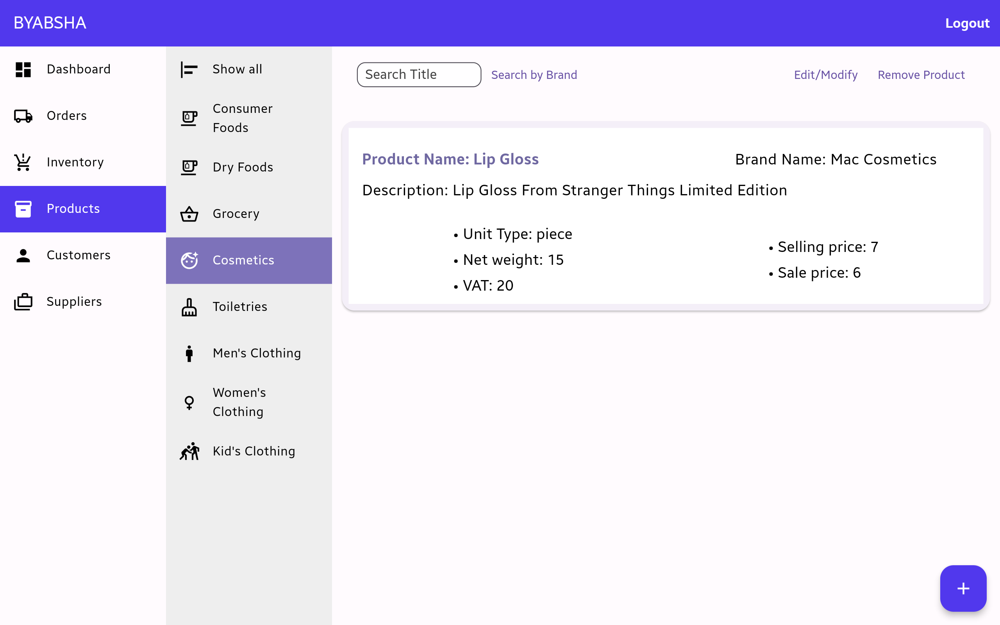
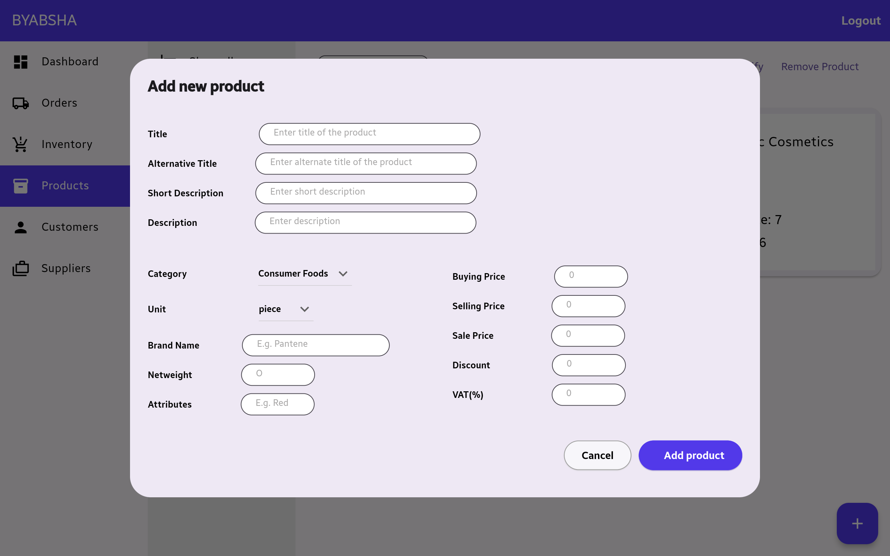
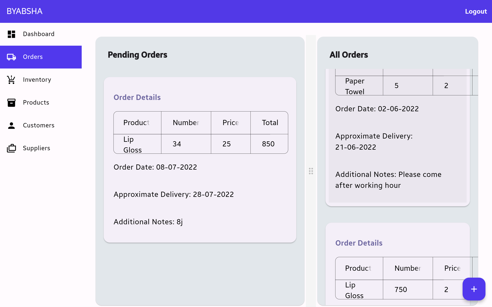
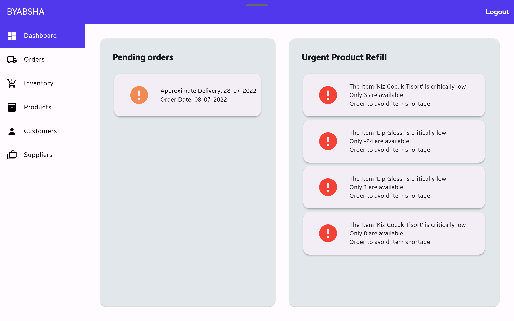

# Byabsha - Inventory Management System

## Introduction

Welcome to "Byabsha", my **Open Inventory Management System** project. This project is a substantial undertaking, designed to offer a simple yet comprehensive solution for inventory management. It's ideal for developers looking to build upon a solid, foundational system.

## Features

### Current Features
- :white_check_mark: **User Authentication**: Secure login system for authorized user access.
- :white_check_mark: **Product Management**: Tools for managing product information effectively.
- :white_check_mark: **Inventory Tracking**: Real-time tracking to maintain optimal stock levels.
- :white_check_mark: **Order Management**: Streamlines the process from order placement to fulfillment.
- :white_check_mark: **Supplier Management**: Manage supplier information and interactions efficiently.
- :white_check_mark: **Cloud Integration (Firebase)**: Ensures data storage, scalability, and access.
- :white_check_mark: **Clean Interface**: Intuitive design for ease of use.

### Planned Features
- :white_large_square: Authorization with roles
- :white_large_square: Image support for products
- :white_large_square: Barcode scanning
- :white_large_square: Enhanced Reporting and Analytics
- :white_large_square: Notifications
- :white_large_square: Reporting and Analytics

## Screenshots

Below are some screenshots of the system in action. These images provide a visual insight into the functionality and interface of the system.

## Getting Started

To run this project:
1. Clone the repository.
2. Install dependencies.
3. Include your `google-services.json` file for Firebase Integration.
4. For more details check the [Flutter documentation](https://docs.flutter.dev/get-started/install).

## Contribution

This project is open-source, the software is provided "as is", without warrenty of any kind. We welcome contributions. Feel free to fork, modify, and submit a pull request.

